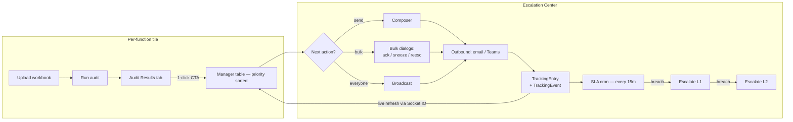

# Audit Engine Rework — Plan (P0 → P2)

> Status: plan. Reviewed by senior-engineer audit on **2026-04-22**. Updated
> once per phase as work lands.

---

## 0. TL;DR

The Master Data audit engine shipped, but a senior-engineer pass found four
load-bearing gaps that make the product partially non-functional today:

1. **Email is read from the workbook, not the Manager Directory.** Master
   Data exports have no email column, so every Master Data issue gets
   `email=""`, which makes notifications hard-fail at compose.
2. **The "function separation" is skin-deep.** 4 of 5 function engines
   wrap the same effort rules. `AuditRule` has no `functionId` column.
   `AuditPolicy` is still one global effort blob. Routing ≠ ownership.
3. **Tracking UX has bulk compose + bulk resolve and nothing else.** No
   acknowledge, no snooze, no re-escalate, no SLA countdown on the row.
4. **Dead and duplicated code.** `projectStatusesJson` built twice inside
   tracking.service; directory delete leaves orphaned issue emails; the
   QGC Settings drawer is effort-only but still styled as "the" settings.

This document prioritises the fixes and defines what we throw away.

---

## 1. Honest architectural audit

### 1.1 Per-function audit engines — **partial**

| Function            | Today                                                | Truth            |
| ------------------- | ---------------------------------------------------- | ---------------- |
| master-data         | Dedicated engine, 10 required-field rules + Others   | Real             |
| over-planning       | Dedicated engine, `RUL-OP-MONTH-PD-HIGH` rule        | Real             |
| missing-plan        | Dedicated engine, `RUL-MP-EFFORT-ZERO` rule          | Real             |
| function-rate       | Dedicated engine, `RUL-FR-RATE-ZERO` rule            | Real             |
| internal-cost-rate  | Dedicated engine, `RUL-ICR-COST-ZERO` rule           | Real             |

All 5 functions now have dedicated engines with isolated rulesets. No
function falls through to the legacy effort-based `runAudit()` anymore.
`createLegacyEngine` remains in the codebase as a safety net for any
future function registered without a dedicated engine, but is unused.

### 1.2 Rule catalog — **not function-scoped**

`AuditRule` schema (`apps/api/prisma/schema.prisma:299-311`) has no
`functionId` column. All rules sit in the same table; rule isolation is
achieved only in TypeScript. An engine could technically emit an issue
with another function's `ruleCode` and nothing in the DB would stop it.

### 1.3 AuditPolicy — **single effort blob**

`AuditPolicy` (`packages/domain/src/types.ts:20-34`) stores effort
thresholds as a flat object on `Process.auditPolicy`. Master Data doesn't
use any of them. Future engines will have nothing clean to extend.

### 1.4 Manager Directory → email — **not wired**

- `AuditIssue.email` is sourced from the workbook row at
  `packages/domain/src/auditEngine.ts:263` (`EMAIL_FIELDS = ['email',
  'Email', 'Manager Email', 'Project Manager Email']`).
- No server-side lookup in `ManagerDirectory` exists anywhere in the audit
  or notification path.
- `ManagerDirectory` already has the primitives (`normalizeManagerKey`,
  alias matching) needed to resolve `"Wagner, Anna"` or `"Anna Wagner"`
  to a single row. They're just not called.

**Consequence:** Master Data files never carry email → every Master Data
issue's email is empty → `tracking-compose.service.ts:193` throws on
send. This is a blocker.

### 1.5 Notifications — **DB-only, no delivery**

`in-app-notifications.service.ts` writes `ActivityLog` rows. There is no
email/Teams/Slack delivery behind any of the in-app notifications. The
SLA engine (`sla-engine.service.ts`) fires every 15 min and transitions
tracking stages correctly, so escalation logic works — just not delivery.

### 1.6 Tracking UI — **too read-only**

`EscalationCenter` + `ManagerTable` today:
- Select rows → compose → send (bulk).
- Select rows → mark resolved (bulk).
- No bulk acknowledge. No snooze. No manual re-escalate. No visible SLA
  countdown on the row. No "missing email" chip.

### 1.7 Dead / duplicated / risky code

- `tracking.service.ts:126-164` and `:199-227` construct the same
  `projectStatusesJson` twice with copy-pasted field maps.
- `DirectoryService.deleteManager()` (line 458-467) checks `TrackingEntry`
  refs but **not** `AuditIssue.email`. Deleting a manager leaves emails
  on issues pointing at an entity that no longer exists.
- `QGC Settings` drawer in `AuditResultsTab.tsx` exists for every
  function even though its fields only apply to effort. We hid the
  button for Master Data; we should do the same for the 3 unbuilt
  functions until they have real policies.
- `AUDIT_RULE_CATALOG` in `auditRules.ts` now concats effort + master-data
  rules by literal spread. Once we add a `functionId` column, this should
  become a per-function registry keyed in code, not a flat array.

---

## 2. Phased plan

### Phase 0 — P0 blockers (this PR)

1. **Directory email resolution in audit pipeline.**
   `audits.service.ts` → after `runFunctionAudit()`, walk the issues and
   for each `projectManager`:
   - normalise via `normalizeObservedManagerLabel`,
   - match against `ManagerDirectory` (scoped by tenantId),
   - write the resolved email onto the `AuditIssue.email` column.

   Applies to **every function**, not just Master Data. Over-planning
   files that happen to have an email column keep the workbook value if
   directory lookup fails — directory is preferred source, workbook is
   fallback. No match + no workbook email → issue persists with
   `email=""` and a flag on the run summary.

2. **Fail-soft composer.**
   `tracking-compose.service.ts:193` currently throws `BadRequestException`.
   Replace with:
   - Skip the entry, don't throw.
   - Response payload lists `{ skipped: [{key, reason: 'missing_email'}] }`.
   - UI shows an amber "Missing email" chip next to the row and a link
     "Add to directory" that opens the directory modal pre-filled with
     the observed name.

### Phase 1 — P1 real separation (next PR)

3. **`AuditRule.functionId` column.**
   Migration adds `functionId TEXT NOT NULL DEFAULT 'over-planning'`
   with FK to `SystemFunction(id)`. Backfill:
   - `RUL-MD-*` → `master-data`
   - `RUL-EFFORT-*`, `RUL-MGR-*`, `RUL-STATE-*` → `over-planning`

   `RulesService` and the seed script write the column from the catalog
   entry. `AUDIT_RULE_CATALOG` becomes a per-function registry:

   ```ts
   const RULE_CATALOG_BY_FUNCTION: Record<FunctionId, RuleCatalogEntry[]> = {
     'master-data':        MASTER_DATA_RULE_CATALOG,
     'over-planning':      OVER_PLANNING_RULE_CATALOG,
     'missing-plan':       [],
     'function-rate':      [],
     'internal-cost-rate': [],
   };
   ```

   Flat `AUDIT_RULE_CATALOG` stays as a compat export (derived from the
   map) so existing callers don't break.

4. **Per-function `AuditPolicy` shape.**
   New type:

   ```ts
   export interface FunctionPolicies {
     'over-planning': OverPlanningPolicy;   // existing effort thresholds
     'master-data':   MasterDataPolicy;     // required-columns toggles
     'missing-plan':  EmptyPolicy;
     'function-rate': EmptyPolicy;
     'internal-cost-rate': EmptyPolicy;
   }
   ```

   Stored under `Process.policies` (JSON). Read-time normaliser migrates
   legacy single-blob policies into `FunctionPolicies['over-planning']`.
   No breaking change at the storage layer.

5. **Promote over-planning to a real module.**
   Move the effort rules out of `packages/domain/src/auditEngine.ts` into
   `functions-audit/over-planning/` with the same structure as
   `master-data/`. `auditEngine.ts` keeps only shared plumbing
   (`createIssueKey`, `runAudit` shim for back-compat, CSV helpers).

### Phase 2 — P1 tracking UX (next PR)

6. **Bulk tracking actions.**
   Add to `ManagerTable` / `EscalationPanel`:
   - **Acknowledge** — bulk transition to ACKNOWLEDGED, logs event.
   - **Snooze N days** — bulk bump `slaDueAt` forward; logs reason.
   - **Re-escalate** — bulk transition back to SENT to force a new L-level.
   - Per-row SLA countdown (hours until `slaDueAt`).
   - "Missing email" chip from Phase 0.

7. **Kill the 'QGC Settings' misnomer.**
   Rename to "Audit Settings", gate fields by `functionId`, and show
   a clear empty state "No configurable thresholds for this function"
   for the 3 unbuilt functions.

### Phase 3 — P2 hygiene

8. **Dedupe tracking service** (`upsert` + `patchEntry` share helpers).
9. **Cascade directory deletes**: when a directory entry is hard-deleted,
   null-out the `email` on matching `AuditIssue` rows in the same
   transaction. Soft-delete (`active=false`) remains the default path.
10. **Remove `findingsByEngine.ts` re-exports that aren't consumed** after
    we ship per-function engines. Keep only the markdown helper that
    `tracking-compose` actually uses.
11. **Doc the 3 unbuilt engines' owners** so the placeholder state has a
    contact person.

---

## 3. What we're deliberately NOT doing

- No new ML/anomaly-detection rules. Stick to deterministic rules until
  we have 6 months of findings data.
- No real email/Slack/Teams delivery in this rework. That's a separate
  integration track.
- No GUI rule editor. YAML-style runtime config can come later — for now
  rules live in TypeScript where they can be type-checked and tested.
- No multi-tenant per-tenant ruleset yet. Current tenants share the
  catalog; per-tenant overrides become a `ProcessRuleOverride` table
  if and when customer demand appears.

---

## 4. Acceptance criteria per phase

### Phase 0 done when
- [ ] Master Data audit on the sample workbook produces issues whose
      `email` column is populated from the directory for every manager
      that exists in the directory.
- [ ] Composing a bulk notification with one missing-email row succeeds
      for the rest and reports the skipped row in the response.
- [ ] UI shows a "Missing email" chip on rows with empty email.
- [ ] New domain + API tests cover: happy-path match, case-insensitive
      match, missing match → empty email, workbook-email fallback.

### Phase 1 done when
- [ ] `AuditRule.functionId` is NOT NULL, every existing rule backfilled,
      new rule inserts enforce the FK.
- [ ] `Process.policies` is a JSON map keyed by functionId; legacy
      single-blob policies still load via the normaliser.
- [ ] Over-planning engine lives in `functions-audit/over-planning/` and
      the legacy `runAudit()` is a 3-line delegator.

### Phase 2 done when
- [ ] ManagerTable has bulk acknowledge / snooze / re-escalate, each
      emits a TrackingEvent and publishes an in-app notification.
- [ ] Each row renders "SLA due in 12h", "Overdue by 4h", or "—" when no
      SLA applies, based on `slaDueAt`.
- [ ] "QGC Settings" is renamed and gated by function.

### Phase 3 done when
- [ ] Tracking service has one code path for projectStatusesJson.
- [ ] Deleting a manager nulls out stale AuditIssue.email in the same tx.
- [ ] `npm run typecheck` + `npm test` across all packages stays green.

---

## 5. Rollout

Each phase is one PR. Phase 0 ships first (it's a bug-fix PR masquerading
as a feature). Phase 1 needs a migration + seed change — ship behind a
migration gate, rerun seed after deploy. Phase 2 is UI-only, safe to iterate
on a branch. Phase 3 is opportunistic cleanup and goes last so we don't
churn files we're still rewriting in Phase 1.

---

## 6. Phase 4 — Notification + tracking consolidation (shipped 2026-04-22)

> The individual function tiles (Master Data, Over Planning, Missing Plan,
> Function Rate, Internal Cost Rate) used to each carry their own
> Notifications tab and — behind a flag — a Tracking tab. The result was
> that the same manager, if flagged across two functions, would receive
> two parallel escalation threads. This phase makes the **Escalation
> Center the single source of truth** for notify + track across every
> function.

### The pipeline



### What changed

- **Tile Notifications tab — gone.** `WorkspaceShell` filters it out;
  `NotificationsRedirect` catches anyone who bookmarked the old URL
  (`?tab=notifications`) and routes them to the Escalation Center.
- **reconcileAfterAudit upserts missing managers.** A fresh manager first
  seen in an audit used to never appear in the Escalation Center because
  the reconciler only patched *existing* `TrackingEntry` rows. Now it
  creates them via `createMany` (with a batched identifier fetch).
- **Broadcast endpoint.** `POST /api/v1/tracking/bulk/broadcast` expands
  "every manager with open findings in this process" (optionally filtered
  by `functionId`) into `trackingIds` and runs the same send pipeline —
  so the UI never has to hand-select for a send-all flow.
- **Escalation Center upgrades**:
  - `AnalyticsStrip` at the top: managers / open findings / SLA breached /
    due-in-48h / missing-email, all derived from the already-loaded rows
    (no extra API call).
  - `BroadcastDialog` header button with channel picker (email / Teams /
    both), optional function scope, and token-aware body.
  - `NextActionChip` per row — deterministic "send reminder" / "escalate
    to L1" / "confirm resolution" / "add to directory" based on stage +
    SLA + email presence.
  - `computePriority()` default sort: breached SLAs float to the top;
    missing-email rows de-weighted so actionable rows come first.
  - Live refresh: the center subscribes to `tracking.updated /
    notification.sent / audit.completed` envelopes and invalidates the
    `['escalations', processId]` + `['tracking-events']` queries, so
    peer users' actions and the SLA cron both reflect without a reload.

### What the user sees

```
[Audit tile]
  Run audit → Audit Results tab
  ┌─────────────────────────────────┐
  │ 12 managers to notify           │
  │ [ Open Escalation Center → ]    │  ← one click
  └─────────────────────────────────┘

[Escalation Center]
  Managers  Open  SLA breached  Due 48h  Missing email
    12      87       3            5         2
  ─────────────────────────────────────────────────────
  [ Broadcast ]                          ? (keyboard help)
  ─────────────────────────────────────────────────────
  Priority-sorted table; every row has Next action chip.
  Select rows → c compose · a ack · s snooze · e escalate · r resolve
```

### What's still deliberately not in scope

- **Real AI.** "Next action" is a rules engine, not a model. We revisit
  when we have 6 months of outcome data.
- **Per-user notification preferences.** Managers still get whatever the
  auditor picks (email / Teams / both). Subscription management is a
  dedicated phase.
- **Template version UI.** Templates already have `version + parentId`
  in the DB; an editor is a future PR.
- **Cross-process broadcast.** Broadcast is scoped to one process. Cross-
  process campaigns are a v2.

---

## 7. Missing Plan engine (shipped 2026-04-23)

The `missing-plan` function now has a dedicated audit engine replacing the
legacy effort-based placeholder.

### Engine behaviour

The engine iterates every valid, selected sheet in the uploaded workbook and
checks each data row for an explicit zero in the Effort (H) column. A zero
effort value indicates that planning hours have not been entered for an
otherwise active project — a different concern from a blank cell (which
means the column was not filled in at all and is not flagged here).

| Condition | Flagged? | Reason |
|-----------|----------|--------|
| `Effort (H)` = 0 (number) | Yes | Zero effort |
| `Effort (H)` = `"0"` (string) | Yes | Zero effort (coerced) |
| `Effort (H)` = `0.0` | Yes | Zero effort |
| `Effort (H)` = 40 | No | Non-zero — no finding |
| `Effort (H)` = blank / absent | No | Missing column, not a planning gap |

### Supported column name aliases

The engine resolves the effort column by trying each alias in order:

```
Effort (H), Effort(H), effort(h), effort (h),
Effort H, effort h, Effort h, EFFORT (H), EFFORT(H), EFFORT H,
Effort, effort, EFFORT,
Hours, hours, HOURS,
Planned Effort, planned effort, PLANNED EFFORT,
Measures Effort, measures effort
```

Matching is alias-based (exact string match after the workbook parser has
normalised headers). Case variations and parenthesis/space differences are
all covered by the alias list.

### Rule codes

| Rule code | Severity | Category | Description |
|-----------|----------|----------|-------------|
| `RUL-MP-EFFORT-ZERO` | Medium | Missing Planning | Effort (H) is 0 on a project row |

All `RUL-MP-*` codes are owned exclusively by the `missing-plan` function.
They will never appear in the master-data or over-planning catalogs.

### Escalation reuse

Issues produced by this engine flow through the **existing** audit pipeline
unchanged:

```
missingPlanAuditEngine.run()
  → AuditIssue[] (ruleCode = RUL-MP-EFFORT-ZERO)
  → resolveIssueEmailsFromDirectory()   // API: audits.service.ts
  → AuditIssue rows persisted
  → statusReconciler.reconcileAfterAudit()
      → upsert TrackingEntry per manager
      → patch projectStatuses.byEngine['missing-plan']
  → Escalation Center aggregation (unchanged)
```

No new escalation mechanism was added. The `EmptyPolicy` slice for
`missing-plan` in `policies.ts` remains correct — this engine has no
configurable thresholds.

---

## Section 8 — Over-Planning Engine (shipped 2026-04-23)

### Behaviour

The dedicated `overPlanningAuditEngine` detects dynamic monthly **Effort PD**
columns and flags projects where any month's PD value **strictly exceeds**
`pdThreshold` (default **30**).

### Column detection

`detectPdColumns(rawRows)` uses two strategies and returns whichever finds
more PD columns:

- **Strategy A (single-row):** scans each header row (up to first 3) for
  cells that satisfy `isPdColumn`. A column is a PD column if it contains
  `\bpd\b` AND a month name (short or long), a numeric month (`01`–`12`),
  or a 4-digit year.
- **Strategy B (two-row merge):** for consecutive row pairs `(i, i+1)`,
  concatenates cells column-by-column and checks if the merged label is a
  PD column (handles `"Effort PD"` + `"Mar 2025"` split-header layouts).

### Rule

`RUL-OP-MONTH-PD-HIGH` — **High** / **Overplanning**

`reason` string: `"<column>: <value> PD exceeds threshold of <N> PD."`

The 7 legacy `RUL-EFFORT-*`, `RUL-MGR-*`, `RUL-STATE-*` rules are retained
in `OVER_PLANNING_ENGINE_RULE_CATALOG` for DB FK integrity; the new engine
never emits them.

### Policy

`pdThreshold?: number` added to `AuditPolicy` (default **30** in
`createDefaultAuditPolicy`). Passed to the engine via the standard
`resolveFunctionPolicy` path.

### Mapping source (optional, over-planning only)

`RunAuditDto.mappingSource` (`MappingSourceDto`) accepts:

| `type`                | Behaviour                                                    |
| --------------------- | ------------------------------------------------------------ |
| `none`                | Skip; fall through to Manager Directory (default)            |
| `master_data_version` | Read completed master-data run's issues for manager→email    |
| `uploaded_file`       | Read another uploaded over-planning file for manager→email   |

Guard: `uploadId === auditFileId` → `BadRequestException`. Emails resolved
from the mapping source are stamped on issues **before**
`resolveIssueEmailsFromDirectory` runs, so the directory acts as a fallback.

`allowUnresolvedFallback` (default `true`): when `false`, unresolved names
are surfaced in `summary.overplanning.unresolvedManagerNames` but issues are
still created (non-blocking).

### Escalation reuse

Same `resolveIssueEmailsFromDirectory → reconcileAfterAudit` pipeline as
every other engine. No new mechanism was added.

### Non-regression guarantee

The master-data engine, all `RUL-MD-*` rules, and the missing-plan engine
are **unchanged** by this change.

---

## 9. Internal Cost Rate — dedicated engine (shipped)

Module: [packages/domain/src/functions-audit/internal-cost-rate/](../packages/domain/src/functions-audit/internal-cost-rate/).

Replaces the `createLegacyEngine('internal-cost-rate')` fallback with a real
engine following the Function Rate pattern.

### Engine behaviour

Monthly cost-rate cells are flagged only when the value is **exactly 0**:

- Numeric `0` (including JS `-0`, since `-0 === 0`) → flagged.
- String forms `"0"`, `"0.0"`, `"  0  "`, `" 0.0 "` → flagged.
- Formula cells evaluating to `0` → flagged (the parser delivers the cached
  computed value; the engine treats it like a literal `0`).
- `null` / `undefined` / empty / whitespace-only / non-numeric text
  (`"n/a"`, `"TBD"`, etc.) → ignored.

One **consolidated issue per row**: a row with N zero months emits a single
issue — never N issues.

### Column detection

`detectCostRateColumns(rawRows)` uses the same two-strategy approach as
Function Rate:

- **Strategy A (single-row):** scans the first 4 header rows and keeps the
  row with the most `isCostRateMonthColumn` matches. A column is a
  cost-rate month column if its normalised label contains a month token
  (short or long name) **AND** a 4-digit year (`(19|20)\d{2}`).
  Intentionally does **not** require the word "rate" — the real ICR file
  headers are bare dates like `"Jan 31, 2026"`.
- **Strategy B (two-row merge):** for consecutive pairs `(i, i+1)`,
  concatenates cells column-by-column and scores the merged label. Handles
  the sample file's `"Effort Month"` banner row above the date row.

Tie-break: Strategy B wins only on strict count; on ties we keep Strategy
A's cleaner labels.

### Rule

`RUL-ICR-COST-ZERO` — **High** / **Internal Cost Rate** category.

`reason` format:
- 1 month: `"Internal cost rate is 0 for <label>."`
- N months: `"Internal cost rate is 0 for <N> months: <label1>, <label2>, …."`

`thresholdLabel: '= 0'`. `effort = zeroMonthCount`.

### Issue context fields

`missingMonths: readonly string[]` and `zeroMonthCount: number` are
populated on the issue. Labels are the **raw trimmed header text** (e.g.
`"Jan 31, 2026"`) preserving the source file's format — no `"Jan-26"`
rewrite — in left-to-right `colIndex` order from the column scan.

**Schema-reuse note:** these fields were introduced for Function Rate on
`AuditIssue` (domain type) and on the Prisma `AuditIssue` model
(`missingMonths Json?`, `zeroMonthCount Int?`). Internal Cost Rate reuses
them unchanged; no migration was needed and no new columns should be
proposed for future ICR-style engines.

### Mapping source + escalation reuse

Internal Cost Rate workbooks have no Project Manager column (same shape as
Function Rate), so the function opts into the existing mapping-source
pipeline. ICR is added to three gates:

- [apps/api/src/audits.service.ts](../apps/api/src/audits.service.ts) →
  `mappingEnabledFunctions` set, plus the Project-ID → Manager pre-pass
  guard (`file.functionId === 'function-rate' || file.functionId ===
  'internal-cost-rate'`). The engine emits issues with
  `projectManager: 'Unassigned'`; the pre-pass (reuses
  `buildProjectIdToManagerMap` + `applyProjectIdToManager`) fills the PM
  name by joining Project ID against the selected mapping source (a
  completed master-data run or an uploaded mapping file).
- [apps/web/src/pages/Workspace.tsx](../apps/web/src/pages/Workspace.tsx)
  and
  [apps/web/src/components/workspace/AuditResultsTab.tsx](../apps/web/src/components/workspace/AuditResultsTab.tsx)
  → `MAPPING_ENABLED_FUNCTIONS` sets. Adding ICR here auto-lights the
  `MappingSourcePanel` and the Run-button mapping-source validation.

Canonical Run/gating behaviour for ICR (matches Function Rate):

1. With ICR in `MAPPING_ENABLED_FUNCTIONS`, the UI **requires** the user to
   explicitly pick a mapping source before Run enables. The valid picks are
   Master Data version, Uploaded mapping file, or the explicit `None`
   (directory-only opt-out).
2. When the picked type is `None`, the API skips the Project-ID pre-pass
   and `buildMappingSourceMap` block entirely — resolution falls through
   to `resolveIssueEmailsFromDirectory` only.
3. Unresolved rows (no mapping match, no directory match) are **still
   persisted** with empty email; they surface in
   `summary.managerDirectory.unresolvedNames` and flow through escalation
   like any other unresolved issue. `allowUnresolvedFallback` defaults
   to `true`; no new policy was introduced.

The summary payload gets a new `internalCostRate` branch mirroring
`functionRate` for observability parity
(`mappingSourceType`, `resolvedProjectIdToManager`, `resolvedFromMapping`,
`allowUnresolvedFallback`).

### Non-regression guarantee

This change touches only:
- the new ICR module (5 new files + 1 test file + 1 test fixture),
- three mapping-gate sets (API + 2 UI locations),
- the `QgcSettingsDrawer`'s ICR branch,
- the `IssueCategory` union (added `'Internal Cost Rate'`),
- the engine registry and rule-catalog map entries for
  `'internal-cost-rate'`,
- this doc.

Master Data, Over Planning, Missing Plan, and Function Rate engines,
rules, policies, and UI are unchanged. An exhaustiveness audit over
`IssueCategory` usages turned up no `switch(category)` blocks in the repo
and one curated filter list
([AuditResultsTab.tsx:41](../apps/web/src/components/workspace/AuditResultsTab.tsx#L41))
that was already not enumerating every category — we preserved that
shape rather than expanding it for ICR, matching the precedent set when
`'Function Rate'` was added.
